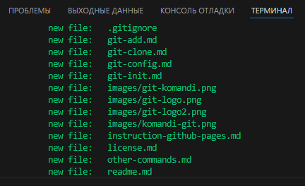

### [< Основные команды:](./readme.md/#2-основные-команды "На главную страницу")     
 ## <u> *git add*</u>

Данная команда позволяет добавить файлы в индекс, обходя игноррируемые(те, что включены в [gitignore](./git-ignore-rules.md)). 

Команда *git add* добавляет изменение из рабочего каталога в раздел проиндексированных файлов. Она сообщает Git, что вы хотите включить изменения в конкретном файле в следующий коммит. Однако на самом деле команда git add не оказывает существенного влияния на репозиторий: изменения регистрируются в нем только после выполнения команды [git commit](./git-commit.md).

  

                

