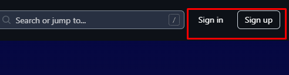
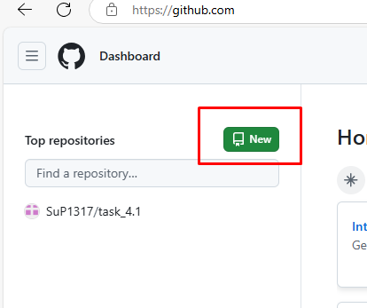
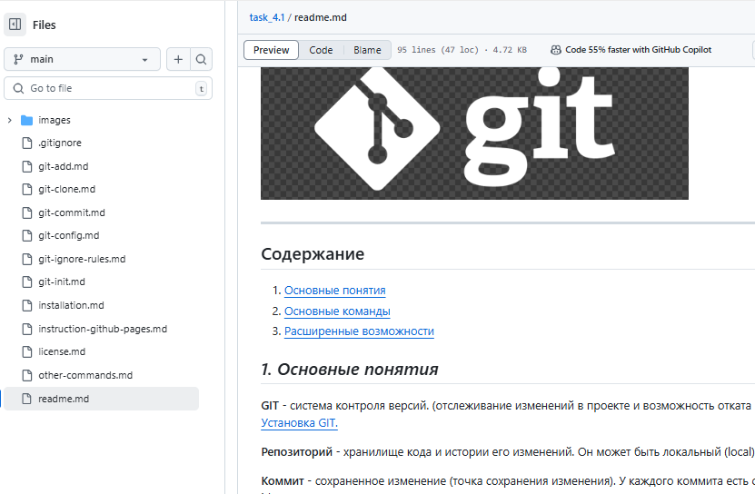
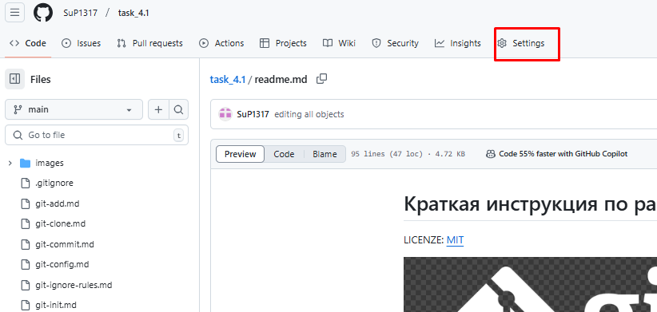
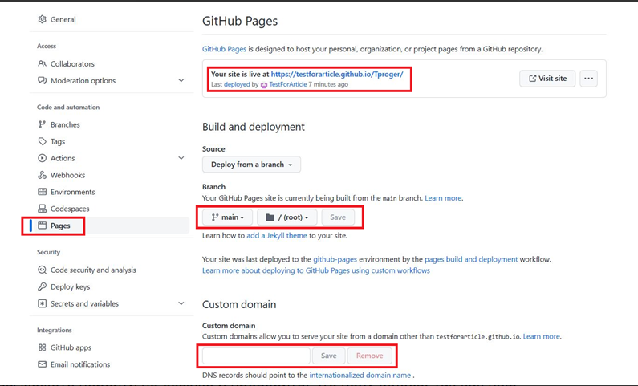

### [< Расширенные возможности:](./readme.md/#3-расширенные-возможности "перейти к разделу") 

## <u> 
*Как создать бесплатный сайт с помощью GitHub Pages*</u> 

**1. Авторизоваться** в личном кабинете на [GitHab](https://github.com/)

**2. Создать новый репозиторий** (если репозиторий и сам проект уже есть, то пропускаем этот шаг).

Далее появится страница с критериями для создания репозитория. Необходимо его имя, описание (не обязательно) и поставить галочку напротив пункта Add a README file. Галочку напротив Public. Остальные настройки менять не нужно. Когда всё будет заполнено, нажмите на зелёную кнопку Create repository.

**3.** Когда **в репозиторий добавлены необходимые файлы** и проект имеет необходимый вид, переходим к пункту 4.

**4. Подключение GitHub Pages**  
Заходим в репозиторий и нажимаем на кнопку Settings

> В меню слева найдите вкладку Pages, затем в блоке Branch поменяйте None на Main. Это нужно для того, чтобы сайт собрался из главной ветки репозитория. После кликните на кнопку Save, подождите пару минут и обновите страницу. В верхней части страницы должна появиться ссылка на сайт. Она состоит из вашего юзернейма, домена GitHub и названия репозитория. При желании вы можете оплатить и использовать личный домен — его нужно указать в разделе Custom domain. 

**Теперь можно перейти по ссылке и проверить, что получилось.**

-----
-----

Author of quote and image-5 (https://tproger.ru/articles/gajd-kak-razmestit-sajt-besplatno-na-github-pages)

