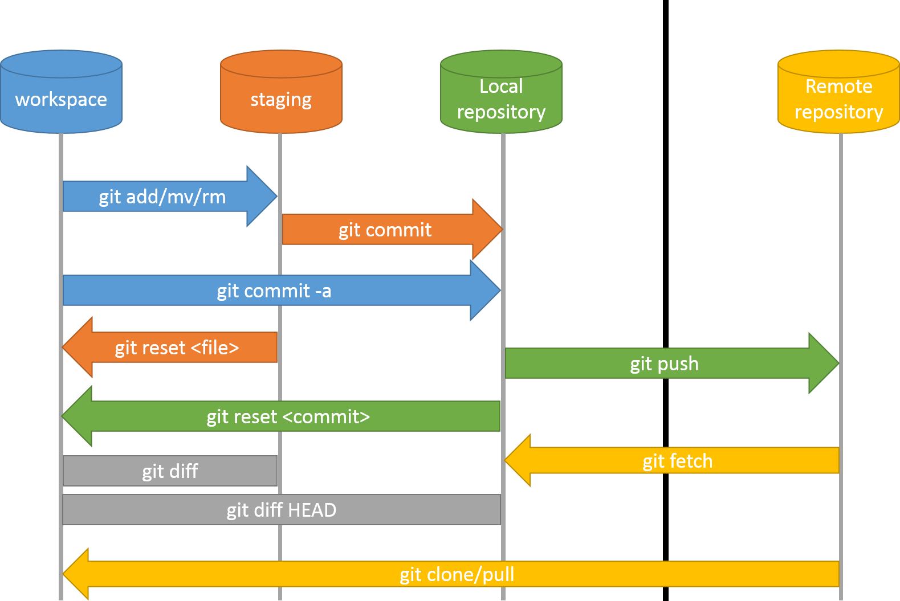

#### [<на основную страницу](./readme.md)

## Другие команды GIT

Возможности Git:

- Анализ изменений, просмотр их истории, сравнение разных версий одних и тех же файлов.

- Защита проекта от случайных изменений и случайного удаления правок или файлов.

- Возможность быстро откатить проект до рабочего состояния при возникновении ошибок.

- Поддержка рабочей версии и параллельное создание новых версий.

- Возможность сливать воедино или разделять изменения одной командой.

- Git ускоряет процесс разработки и делает его более эффективным.

Для осущствления больших возможностей GIT, естественно, существует множество команд. 

 ***git status*** - **Просмотреть статус** нужного **репозитория** можно по ключевому слову status: его действие распространяется на подготовленные, неподготовленные и неотслеживаемые файлы.

***git log -p***  - **Просматривать изменения**, внесённые в репозиторий, можно с помощью параметра log. Он отображает список последних коммитов в порядке выполнения. Кроме того, добавив флаг -p, вы можете подробно изучить изменения, внесённые в каждый файл.

***git diff*** - Можно **просматривать список изменений**, внесённых в репозиторий, используя параметр diff. По умолчанию отображаются только изменения, **не подготовленные для фиксации**.

***git rm*** -**Удалять файлы из текущего рабочего дерева** можно с помощью параметра rm. При этом файлы удаляются и из индекса.

***git mv*** - **Переименовать файл или папку** можно параметром mv. Для него указывается источник source и назначение destination. Источник — реально существующий файл или папка, а назначение — существующая папка.

***git checkout***- **Восстановить файлы рабочего дерева**, **не подготовленные к коммиту**, можно параметром checkout. Для проведения операции требуется указать путь к файлу. Если путь не указан, параметр git checkout изменит указатель HEAD, чтобы задать указанную ветку как текущую.

***git reset HEAD*** - **Восстановить подготовленный файл рабочего дерева** можно параметром reset. Потребуется указать путь к файлу, чтобы убрать его из области подготовленных файлов. При этом не будет производиться откат никаких изменений или модификаций — однако файл перейдёт в категорию не подготовленных к коммиту.

***git push***- **стереть удалённую ветку**

***git merge*** - **Объединить** две **ветки** можно параметром merge с указанием имени ветки. Команда объединит указанную ветку с основной: git merge existing_branch_name

**И многие другие команды**. Кроме того есть разные вариации комбинированных команд, которые используются в зависимости от необходимых действий. Любые из них возможно найти в открытых источниках на просторах интернета. 

---
Scheme image2 (https://avatars.mds.yandex.net/i?id=5064dcecd948e52edecbf41e30fc96bf8f7bb05d-13061786-images-thumbs&n=13)